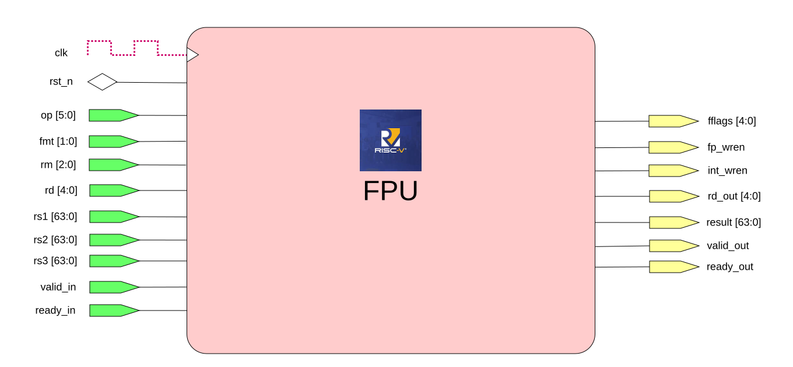

# RISC-V FPU — RV64GC Floating-Point Unit

Fully synthesisable SystemVerilog implementation of the RISC-V F/D/Zfh floating-point extensions targeting a 64-bit (RV64) pipeline.



---

## Features

| Feature | Detail |
|---|---|
| Supported formats | FP16 (half), FP32 (single), FP64 (double) |
| Integer interface | 64-bit signed/unsigned |
| Rounding modes | RNE · RTZ · RDN · RUP · RMM (all five IEEE 754-2008 modes) |
| Exception flags | NV · DZ · OF · UF · NX |
| Interface style | Ready/valid handshake via `fpu_if` SystemVerilog interface |
| Target toolchain | Verilator (simulation) · any standard RTL synthesis flow |

---

## Supported Instructions

| Group | Instructions | Latency |
|---|---|---|
| Add / Subtract | `FADD`, `FSUB` | 4 cycles |
| Multiply | `FMUL` | 4 cycles |
| Fused Multiply-Add | `FMADD`, `FMSUB`, `FNMSUB`, `FNMADD` | 5 cycles |
| Divide / Square-root | `FDIV`, `FSQRT` | ~58 cycles (FSM) |
| Min / Max | `FMIN`, `FMAX` | 1 cycle |
| Comparisons | `FEQ`, `FLT`, `FLE` | 1 cycle |
| Sign injection | `FSGNJ`, `FSGNJN`, `FSGNJX` | 1 cycle |
| Classification | `FCLASS` | 1 cycle |
| Conversions | `FCVT.F2F`, `FCVT.F2I`, `FCVT.I2F` | 1 cycle |

FDIV/FSQRT is not pipelined (new operation accepted only when the FSM returns to IDLE). All other units are fully pipelined with independent ready/valid control.

---

## Architecture

```
                         ┌──────────┐
  CPU ──fpu_if──────────►│  fpu.sv  │◄──────────── fpu_if ──► CPU
                         │ (top)    │
                         └────┬─────┘
                              │  op decode
          ┌───────────────────┼──────────────────────────────────┐
          │                   │                                  │
     ┌────▼────┐  ┌──────┐  ┌─▼──┐  ┌───────┐  ┌───────┐  ┌───▼───┐
     │ funpack │  │fclass│  │fsgn│  │fminmax│  │  fcmp │  │fcvt   │
     │  (x3)   │  │  1cy │  │ 1cy│  │  1cy  │  │  1cy  │  │  1cy  │
     └────┬────┘  └──────┘  └────┘  └───────┘  └───────┘  └───────┘
          │
   ┌──────┼──────────┬──────────┐
   │      │          │          │
┌──▼──┐ ┌─▼──┐  ┌───▼──┐  ┌───▼────┐
│fadd │ │fmul│  │ fma  │  │fdivsqrt│
│sub  │ │ 4cy│  │  5cy │  │  ~58cy │
│ 4cy │ └──┬─┘  └──┬───┘  └───┬────┘
└──┬──┘    │       │           │
   └────────┴───────┘           │
            │  arith mux        │
         ┌──▼────────────────────▼──┐
         │        fround            │
         │   (IEEE 754 rounding)    │
         └──────────────┬───────────┘
                        │
                   ┌────▼─────┐
                   │  fpack   │
                   │(IEEE pack│
                   └──────────┘
```

### Pipeline front-end (`ffront/`)

| Module | Role |
|---|---|
| `funpack.sv` | Combinational IEEE 754 unpack — extracts sign, biased exponent, mantissa, and special-case flags (zero / inf / qNaN / sNaN / subnormal) for all three formats |
| `fclassify.sv` | Helper used by `fclass` to produce the RISC-V 10-bit one-hot classification mask |

### Functional units (`fcore/`)

| Module | Operations |
|---|---|
| `faddsub.sv` | 4-stage pipelined add/subtract with exponent alignment and leading-zero normalisation |
| `fmult.sv` | 4-stage pipelined multiplier (partial-product tree → normalise) |
| `fma.sv` | 5-stage fused multiply-add; sign polarity for FMSUB/FNMSUB/FNMADD is handled in the top-level before dispatch |
| `fdivsqrt.sv` | Radix-2 iterative FSM for FDIV and FSQRT; ~58 cycles for FP64; accepts a new operation only when idle |
| `fclass.sv` | Single-cycle FCLASS — produces the 10-bit RISC-V class mask in the integer register bank |
| `fcmp.sv` | Single-cycle FEQ / FLT / FLE; NaN-aware per IEEE 754 (qNaN silently returns 0 for FEQ, raises NV for ordered comparisons) |
| `fminmax.sv` | Single-cycle FMIN / FMAX with IEEE 754-2008 minNum/maxNum NaN handling |
| `fsgn.sv` | Single-cycle FSGNJ / FSGNJN / FSGNJX — bit manipulation only, no arithmetic |
| `fconvert.sv` | Single-cycle format conversions: F2F (all format pairs), F2I (float → signed 64-bit integer), I2F (integer → float) |

### Pipeline back-end (`fback/`)

| Module | Role |
|---|---|
| `fround.sv` | Combinational IEEE 754 rounding and re-normalisation using guard/round/sticky bits; shared by faddsub, fmult, fma, and fdivsqrt via the arith mux |
| `fpack.sv` | Combinational pack of (sign, exponent, mantissa) into a 64-bit IEEE 754 bit pattern; parameterised for all three formats |

### Top-level (`fpu.sv`)

The top level:
1. Decodes the opcode into nine mutually exclusive `op_is_*` flags.
2. Instantiates three shared `funpack` modules (rs1, rs2, rs3).
3. Gates `valid_in` per unit based on the decoded op.
4. Pipelines the destination register `rd` independently for each unit to match its latency.
5. Selects the result, `fflags`, `fp_wen`/`int_wen`, and `rd_out` via a priority output mux.

---

## Interface (`fpu_if.sv`)

```systemverilog
interface fpu_if #(parameter XLEN = 64);

    // Handshake
    logic valid_in;   // CPU → FPU: operation presented
    logic ready_out;  // FPU → CPU: unit ready to accept
    logic valid_out;  // FPU → CPU: result available
    logic ready_in;   // CPU → FPU: CPU ready to consume result

    // Instruction fields (CPU → FPU)
    fpu_op_e     op;   // operation (see fpu_pkg.sv)
    fpu_fmt_e    fmt;  // FMT_FP16 | FMT_FP32 | FMT_FP64
    fpu_rm_e     rm;   // rounding mode
    logic [4:0]  rd;   // destination register index

    // Operands (CPU → FPU)
    logic [XLEN-1:0] rs1, rs2, rs3;   // rs3 used only by FMA ops

    // Result (FPU → CPU)
    logic [4:0]      rd_out;   // destination index aligned to result
    logic [XLEN-1:0] result;   // FP or integer result
    logic            fp_wen;   // write to FP register bank
    logic            int_wen;  // write to integer register bank
    logic [4:0]      fflags;   // {NV, DZ, OF, UF, NX}

endinterface
```

The CPU drives `op`, `fmt`, `rm`, `rd`, `rs1`/`rs2`/`rs3`, and `valid_in`. It reads `result`, `rd_out`, `fp_wen`, `int_wen`, `fflags`, and `valid_out`. The `ready_out` / `ready_in` signals form the standard ready-valid handshake.

---

## Package (`fpu_pkg.sv`)

The `fpkg` package defines all shared types:

```systemverilog
typedef enum logic [1:0] { FMT_FP16, FMT_FP32, FMT_FP64, FMT_INT } fpu_fmt_e;

typedef enum logic [2:0] {
    RM_RNE,   // Round to Nearest, ties to Even
    RM_RTZ,   // Round Toward Zero
    RM_RDN,   // Round Down (toward −∞)
    RM_RUP,   // Round Up   (toward +∞)
    RM_RMM    // Round to Nearest, ties to Max Magnitude
} fpu_rm_e;

typedef enum logic [5:0] {
    FPU_ADD, FPU_SUB, FPU_MUL, FPU_DIV, FPU_SQRT,
    FPU_FMA, FPU_FMSUB, FPU_FNMSUB, FPU_FNMADD,
    FPU_MIN, FPU_MAX,
    FPU_SGNJ, FPU_SGNJN, FPU_SGNJX,
    FPU_CMP_EQ, FPU_CMP_LT, FPU_CMP_LE,
    FPU_CVT_F2F, FPU_CVT_F2I, FPU_CVT_I2F,
    FPU_CLASS
} fpu_op_e;
```

---

## Simulation

### Requirements

- [Verilator](https://verilator.org) ≥ 5.x
- GTKWave (optional, for waveform viewing)

### Build & run

```bash
cd testbench
make sim        # compile and run the testbench
make waves      # open fpu_tb.vcd in GTKWave
make clean      # remove build artefacts
```

The Makefile compiles all design sources together with `fpu_tb.sv` via Verilator and runs the simulation binary directly. A `fpu_tb.vcd` waveform dump is produced automatically.

### Testbench coverage

`testbench/fpu_tb.sv` contains manually verified IEEE 754 golden values covering:

| Operation group | Test cases |
|---|---|
| FADD / FSUB (FP64) | Normal, ±inf, qNaN, sNaN, exact cancellation |
| FMUL (FP64) | Normal, sign propagation, 0×∞ invalid, NaN propagation |
| FMADD / FMSUB / FNMSUB / FNMADD | Sign polarity variants, inf, NaN |
| FCLASS (FP64) | All 10 RISC-V classes |
| FEQ / FLT / FLE | Equality, ordering, ±0 equality, NaN behaviour |
| FMIN / FMAX | Normal, signed zero, one-NaN, both-NaN, ±inf |
| FDIV / FSQRT | Special cases (0/0, ∞/∞, x/0, √neg, NaN) |
| FSGNJ / FSGNJN / FSGNJX | Sign copy, negate, XOR |
| FCVT F2F | All six format pairs (FP16↔FP32↔FP64) |
| FCVT F2I | Normal values, ±1.0, 0.5→0+NX, ±inf→saturation |
| FCVT I2F | Integer → float, zero, negative |

Each test checks `result`, `fflags`, `fp_wen`, `int_wen`, and `rd_out`.

---

## Repository layout

```
FPU/
├── design/
│   ├── fpu_pkg.sv          # shared types and functions
│   ├── fpu_if.sv           # CPU–FPU SystemVerilog interface
│   ├── fpu.sv              # top-level module
│   ├── ffront/
│   │   ├── funpack.sv      # IEEE 754 unpack (combinational)
│   │   └── fclassify.sv    # FCLASS helper
│   ├── fcore/
│   │   ├── faddsub.sv      # 4-cycle add/subtract pipeline
│   │   ├── fmult.sv        # 4-cycle multiplier pipeline
│   │   ├── fma.sv          # 5-cycle fused multiply-add pipeline
│   │   ├── fdivsqrt.sv     # ~58-cycle divide/sqrt FSM
│   │   ├── fclass.sv       # 1-cycle classification
│   │   ├── fcmp.sv         # 1-cycle comparisons
│   │   ├── fminmax.sv      # 1-cycle min/max
│   │   ├── fsgn.sv         # 1-cycle sign injection
│   │   └── fconvert.sv     # 1-cycle format conversions
│   └── fback/
│       ├── fround.sv       # IEEE 754 rounding (combinational)
│       └── fpack.sv        # IEEE 754 pack (combinational)
└── testbench/
    ├── fpu_tb.sv           # self-checking testbench
    ├── Makefile            # Verilator build rules
    └── fpu_tb.vcd          # waveform output (generated)
```

---

## Author

**ekonihc** — April / May 2026

See my profile [Kouachi Corneille EKON](https://www.linkedin.com/in/ekon-ihc/)
